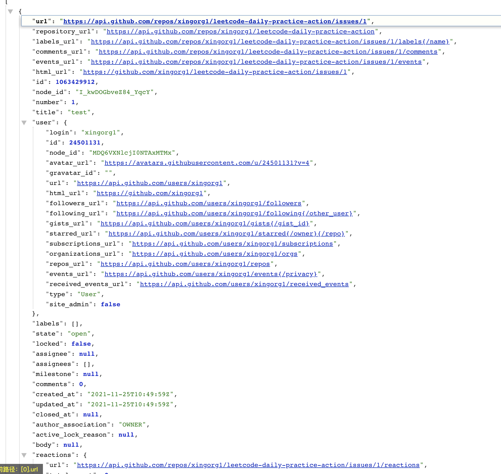

## todo
- [ ] 定时创建issue
- [ ] 创建新issue前，把上一个issue没有打卡的人数统计一下（自动打标签，根据打卡名单，排除已提交issue的人，剩下的人打成标签）

## octokit 依赖升级，语法需要修改
```bash
Run xingorg1/leetcode-daily-practice-action@1.1.0
/home/runner/work/_actions/xingorg1/leetcode-daily-practice-action/1.1.0/dist/index.js:3260
        throw new Error('Parameter token or opts.auth is required');
        ^

Error: Parameter token or opts.auth is required
    at Object.getAuthString (/home/runner/work/_actions/xingorg1/leetcode-daily-practice-action/1.1.0/dist/index.js:3260:15)
    at Object.getOctokitOptions (/home/runner/work/_actions/xingorg1/leetcode-daily-practice-action/1.1.0/dist/index.js:3133:24)
    at Object.getOctokit (/home/runner/work/_actions/xingorg1/leetcode-daily-practice-action/1.1.0/dist/index.js:1982:39)
    at main (/home/runner/work/_actions/xingorg1/leetcode-daily-practice-action/1.1.0/dist/index.js:7767:26)
    at Object.897 (/home/runner/work/_actions/xingorg1/leetcode-daily-practice-action/1.1.0/dist/index.js:7770:3)
    at __webpack_require__ (/home/runner/work/_actions/xingorg1/leetcode-daily-practice-action/1.1.0/dist/index.js:24:31)
    at startup (/home/runner/work/_actions/xingorg1/leetcode-daily-practice-action/1.1.0/dist/index.js:43:19)
    at /home/runner/work/_actions/xingorg1/leetcode-daily-practice-action/1.1.0/dist/index.js:47:18
    at Object.<anonymous> (/home/runner/work/_actions/xingorg1/leetcode-daily-practice-action/1.1.0/dist/index.js:50:10)
    at Module._compile (internal/modules/cjs/loader.js:959:30)
```

## 找不到仓库

```bash
Error:
https://api.github.com/repos/xingorg1/leetcode-daily-practice-action/issues

https://github.com/xingorg1/leetcode-daily-practice-action/issues/1
```
